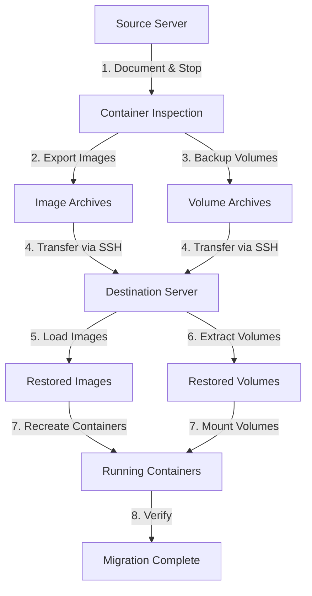

# Podman Container Migration Plan

## Overview
This guide provides step-by-step instructions for migrating Podman containers and their mounted volumes from a source server to a destination server using direct SSH access.

## Prerequisites
- SSH access between source and destination servers
- Sufficient disk space on both servers for exports
- Podman installed on both servers
- Root or sudo access on both servers

## Migration Architecture



## Step-by-Step Migration Process

### Phase 1: Documentation and Preparation (Source Server)

#### 1.1 List All Running Containers
```bash
# List all containers with their status
podman ps -a

# Get detailed information about each container
podman inspect <container_name> > container_<container_name>_config.json
```

#### 1.2 Document Container Configurations
For each container, capture:
```bash
# Get the run command that created the container
podman inspect <container_name> --format='{{.Config.Cmd}}'

# Get environment variables
podman inspect <container_name> --format='{{.Config.Env}}'

# Get port mappings
podman inspect <container_name> --format='{{.NetworkSettings.Ports}}'

# Get volume mounts
podman inspect <container_name> --format='{{.Mounts}}'
```

#### 1.3 Create a Migration Manifest
Create a file `migration-manifest.txt` listing:
- Container names
- Image names and tags
- Volume mount paths (host:container)
- Port mappings
- Environment variables
- Network configurations

### Phase 2: Stop Containers (Source Server)

#### 2.1 Stop All Containers Gracefully
```bash
# Stop containers one by one (allows graceful shutdown)
podman stop <container_name>

# Or stop all containers
podman stop $(podman ps -q)

# Verify all containers are stopped
podman ps -a
```

**Important:** Keep containers stopped until migration is verified successful on the destination server.

### Phase 3: Export Container Images (Source Server)

#### 3.1 Commit Running Containers to Images (if needed)
```bash
# If you want to preserve the current state of a container
podman commit <container_name> <image_name>:migration

# Example:
podman commit myapp_container myapp:migration
```

#### 3.2 Save Images to Tar Archives
```bash
# Create a directory for exports
mkdir -p /tmp/podman-migration/images

# Save each image
podman save -o /tmp/podman-migration/images/<image_name>.tar <image_name>:<tag>

# Example:
podman save -o /tmp/podman-migration/images/myapp.tar myapp:migration

# Compress to save space and transfer time
gzip /tmp/podman-migration/images/<image_name>.tar
```

#### 3.3 Save All Images at Once (Alternative)
```bash
# Get list of all images used by containers
podman ps -a --format "{{.Image}}" | sort -u > /tmp/image-list.txt

# Save all images
while read image; do
    filename=$(echo $image | tr '/:' '_')
    podman save -o /tmp/podman-migration/images/${filename}.tar $image
    gzip /tmp/podman-migration/images/${filename}.tar
done < /tmp/image-list.txt
```

### Phase 4: Backup Volume Data (Source Server)

#### 4.1 Identify Volume Mount Points
```bash
# List all volume mounts for each container
podman inspect <container_name> --format='{{range .Mounts}}{{.Source}} -> {{.Destination}}{{"\n"}}{{end}}'
```

#### 4.2 Create Volume Backups
```bash
# Create directory for volume backups
mkdir -p /tmp/podman-migration/volumes

# Backup each volume (replace /path/to/volume with actual path)
tar -czf /tmp/podman-migration/volumes/<container_name>_<volume_name>.tar.gz -C /path/to/volume .

# Example for a container with volume at /var/lib/myapp/data:
tar -czf /tmp/podman-migration/volumes/myapp_data.tar.gz -C /var/lib/myapp/data .

# Preserve permissions and ownership
sudo tar -czpf /tmp/podman-migration/volumes/<container_name>_<volume_name>.tar.gz -C /path/to/volume .
```

#### 4.3 Create Volume Manifest
```bash
# Document volume mappings
cat > /tmp/podman-migration/volume-manifest.txt << EOF
# Container: Volume Archive: Source Path: Destination Path in Container
myapp:myapp_data.tar.gz:/var/lib/myapp/data:/app/data
database:database_data.tar.gz:/var/lib/postgresql/data:/var/lib/postgresql/data
EOF
```

### Phase 5: Transfer to Destination Server

#### 5.1 Transfer Images
```bash
# From source server, transfer images directory
rsync -avz --progress /tmp/podman-migration/images/ user@destination-server:/tmp/podman-migration/images/

# Or use scp
scp -r /tmp/podman-migration/images/* user@destination-server:/tmp/podman-migration/images/
```

#### 5.2 Transfer Volumes
```bash
# Transfer volumes directory
rsync -avz --progress /tmp/podman-migration/volumes/ user@destination-server:/tmp/podman-migration/volumes/

# Or use scp
scp -r /tmp/podman-migration/volumes/* user@destination-server:/tmp/podman-migration/volumes/
```

#### 5.3 Transfer Configuration Files
```bash
# Transfer container configs and manifests
scp /tmp/podman-migration/*.txt user@destination-server:/tmp/podman-migration/
scp container_*_config.json user@destination-server:/tmp/podman-migration/
```

### Phase 6: Load Images (Destination Server)

#### 6.1 Load Container Images
```bash
# Load each image
for image in /tmp/podman-migration/images/*.tar.gz; do
    gunzip -c "$image" | podman load
done

# Verify images are loaded
podman images
```

### Phase 7: Restore Volume Data (Destination Server)

#### 7.1 Create Volume Directories
```bash
# Create directories for volumes (adjust paths as needed)
sudo mkdir -p /var/lib/myapp/data
sudo mkdir -p /var/lib/postgresql/data

# Set appropriate ownership (adjust user:group as needed)
sudo chown -R 1000:1000 /var/lib/myapp/data
```

#### 7.2 Extract Volume Data
```bash
# Extract each volume archive to its destination
sudo tar -xzpf /tmp/podman-migration/volumes/<container_name>_<volume_name>.tar.gz -C /path/to/destination

# Example:
sudo tar -xzpf /tmp/podman-migration/volumes/myapp_data.tar.gz -C /var/lib/myapp/data

# Verify extraction
ls -la /var/lib/myapp/data
```

### Phase 8: Recreate Containers (Destination Server)

#### 8.1 Recreate Containers with Same Configuration
```bash
# Use the original podman run command with volume mounts
podman run -d \
  --name <container_name> \
  -v /host/path:/container/path \
  -p host_port:container_port \
  -e ENV_VAR=value \
  <image_name>:<tag>

# Example:
podman run -d \
  --name myapp_container \
  -v /var/lib/myapp/data:/app/data \
  -p 8080:8080 \
  -e DATABASE_URL=postgresql://localhost/mydb \
  myapp:migration
```

#### 8.2 Alternative: Use Podman Generate Kube (Advanced)
```bash
# On source server (before stopping), generate Kubernetes YAML
podman generate kube <container_name> > <container_name>.yaml

# Transfer YAML to destination
scp <container_name>.yaml user@destination-server:/tmp/

# On destination server, play the YAML
podman play kube <container_name>.yaml
```

### Phase 9: Verification and Testing

#### 9.1 Verify Containers Are Running
```bash
# Check container status
podman ps -a

# Check container logs
podman logs <container_name>

# Check container health
podman inspect <container_name> --format='{{.State.Status}}'
```

#### 9.2 Verify Volume Data
```bash
# Enter container and check data
podman exec -it <container_name> ls -la /container/mount/path

# Verify file permissions
podman exec -it <container_name> ls -ln /container/mount/path
```

#### 9.3 Test Application Functionality
```bash
# Test network connectivity
curl http://localhost:port/health

# Test database connections
podman exec -it <database_container> psql -U user -d database -c "SELECT 1;"

# Check application logs for errors
podman logs <container_name> --tail 100
```

### Phase 10: Post-Migration Tasks

#### 10.1 Update DNS/Network Configuration
- Update DNS records to point to new server IP
- Update load balancer configurations
- Update firewall rules if needed
- Update monitoring/alerting configurations

#### 10.2 Cleanup Source Server (After Verification)
```bash
# Only after confirming successful migration!
# Remove containers
podman rm <container_name>

# Remove images (optional)
podman rmi <image_name>

# Clean up export directory
rm -rf /tmp/podman-migration
```

#### 10.3 Cleanup Destination Server
```bash
# Remove temporary migration files
rm -rf /tmp/podman-migration
```

## Troubleshooting

### Issue: Permission Denied on Volume Mounts
```bash
# Check SELinux context (if enabled)
ls -Z /path/to/volume

# Fix SELinux context
sudo chcon -Rt svirt_sandbox_file_t /path/to/volume

# Or disable SELinux for testing
sudo setenforce 0
```

### Issue: Container Won't Start
```bash
# Check logs for errors
podman logs <container_name>

# Inspect container configuration
podman inspect <container_name>

# Try running interactively
podman run -it --rm <image_name> /bin/bash
```

### Issue: Network Connectivity Problems
```bash
# Check port bindings
podman port <container_name>

# Check firewall rules
sudo firewall-cmd --list-all

# Test from host
curl http://localhost:port
```

### Issue: Volume Data Missing or Corrupted
```bash
# Verify tar archive integrity
tar -tzf /tmp/podman-migration/volumes/<archive>.tar.gz | head

# Re-extract with verbose output
sudo tar -xzvpf /tmp/podman-migration/volumes/<archive>.tar.gz -C /destination
```

## Best Practices

1. **Always test the migration process** in a non-production environment first
2. **Create backups** of both source and destination servers before migration
3. **Document everything** - save all commands and configurations
4. **Verify data integrity** using checksums for critical data
5. **Plan for downtime** - communicate with stakeholders about the migration window
6. **Keep source server intact** until migration is fully verified
7. **Use compression** for faster transfers over network
8. **Monitor disk space** during export and import operations
9. **Test rollback procedures** before starting migration
10. **Update documentation** after successful migration

## Quick Reference Commands

### Source Server Checklist
```bash
# 1. List containers
podman ps -a

# 2. Stop containers
podman stop $(podman ps -q)

# 3. Export images
podman save -o image.tar image:tag && gzip image.tar

# 4. Backup volumes
tar -czpf volume.tar.gz -C /volume/path .

# 5. Transfer files
rsync -avz /tmp/podman-migration/ user@dest:/tmp/podman-migration/
```

### Destination Server Checklist
```bash
# 1. Load images
gunzip -c image.tar.gz | podman load

# 2. Create volume directories
mkdir -p /volume/path && chown user:group /volume/path

# 3. Extract volumes
tar -xzpf volume.tar.gz -C /volume/path

# 4. Run containers
podman run -d --name container -v /host:/container image:tag

# 5. Verify
podman ps && podman logs container
```

## Additional Resources

- [Podman Documentation](https://docs.podman.io/)
- [Container Migration Best Practices](https://www.redhat.com/en/topics/containers)
- [Podman vs Docker Commands](https://docs.podman.io/en/latest/markdown/podman.1.html)

## Notes

- This migration approach ensures data consistency by stopping containers before export
- Direct SSH transfer is efficient for servers with good network connectivity
- Consider using `rsync` with `--partial` flag for resumable transfers on large files
- Test the entire process with a single container first before migrating all containers